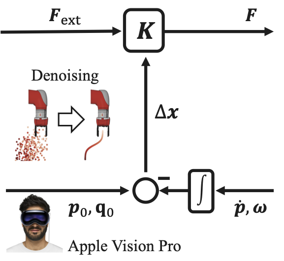

# Diffusion-Based Impedance Learning for Contact-Rich Manipulation Tasks  

**Undisclosed authors for double-anonymous review**  

🔗 [Project Website](https://diffusion-imp-anon.github.io/DiffusionBasedImpedanceLearning/)  

---

## Abstract  

Learning-based methods excel at motion generation in the information domain but are not primarily designed for physical interaction in the energy domain. Impedance Control enables safe physical interaction but requires task-aware tuning of stiffness and damping parameters. We present Diffusion-Based Impedance Learning, a framework that combines both domains. A Transformer-based Diffusion Model with cross-attention to external wrenches reconstructs simulated Zero-Force Trajectories (sZFT) that capture contact-consistent equilibrium behavior in both translation and rotation. For rotations, we introduce a novel SLERP-based quaternion noise scheduler that preserves geometric consistency on the unit sphere. The reconstructed sZFT drives an energy-based estimator that adapts stiffness and damping parameters online. A directional adaptation rule reduces impedance along non-task relevant axes while preserving rigidity where needed for execution.
Trained on data of parkour and robotic-assisted therapy tasks collected using teleoperation with Apple Vision Pro, the model achieved sub-millimeter positional accuracy and sub-degree rotational accuracy using only ten of thousand of samples. The compact model size enabled real-time torque control and autonomous stiffness adaptation on a KUKA LBR iiwa robot. Experimental validation demonstrates smooth parkour traversal within force and velocity limits and 30/30 (100\%) insertion success across cylindrical, square, and star pegs without any geometry-specific information in the training data.
Code for the transformer-based diffusion model, the robot controller, and the Apple Vision Pro telemanipulation framework is publicly available. These results demonstrate that bridging information and energy domains enables robust realization of contact-rich manipulation tasks.
<p align="center">
  
</p>

## Hardware Setup

- **Robot:** KUKA **LBR iiwa** (7 DOF) in **torque control** via **FRI** at **5 ms** sample time.  
- **Kinematics/Dynamics:** Computed in C++ via the [**Exp[licit]-FRI**](https://github.com/explicit-robotics/Explicit-FRI) interface.  
- **External Wrenches:** **ATI Gamma** force/torque transducer attached to the flange.  
- **Baseline Controller Params:**  
  - Translational baseline stiffness: **800 N/m**  
  - Rotational baseline stiffness: **150 Nm/rad**  
  - Damping proportional to stiffness (see controller appendices in paper).  
  - Force/moment thresholds for adaptation: **1 N** and **1 Nm**.  
- **Safety Stops (parkour experiments):** **‖v‖ = 0.24 m/s** and **‖f_ext‖ = 20 N**.  
- **Teleoperation (data collection):** **Apple Vision Pro** (VisionProTeleop) streams 6-DoF hand pose over shared memory to the C++ controller (ZFT-based telemanipulation).  
- **Workpieces/Fixtures:** Parkour obstacles (bumper, circular target, ramp, tabletop) and peg-in-hole with **cylindrical**, **square**, and **star** pegs. All parts were **3D-printed on a PRUSA i3 MK3 (PLA)**. CAD files can be found in this repository. Videos are linked on the project page.

---

## Environment Setup  

We recommend creating a conda environment using the provided `environment.yml` file.  

```bash
# Clone the repository
git clone https://github.com/diffusion-imp-anon/Diffusion-Based-Impedance-Learning.git
cd DiffusionBasedImpedanceAdaptation

# Create conda environment
conda env create -f environment.yml

# Activate environment
conda activate ImpedanceLearning
```

## AVP Telemanipulation

### Interface

The KUKA LBR iiwa can be **telemanipulated using the Apple Vision Pro** to collect your own training data.

To telemanipulate the robot, the [TrackingStreamer app](https://github.com/Improbable-AI/VisionProTeleop) on the **Apple Vision Pro** must be started.  

Afterwards, update the IP address in:  
`AVPTelemanipulation/avp_stream/VisionProCPPCommunication.py`

Then run the script to start the interface communication between the **Apple Vision Pro** and the **C++ robot controller**:  

```bash
python AVPTelemanipulation/avp_stream/VisionProCPPCommunication.py
```

<p align="center">
  <a href="https://www.youtube.com/watch?v=A7IriNSKP2w">
    
  </a>
</p>


## Data for Training and Inference Simulation
The model can be trained and evaluated on data collected via the telemanipulation procedure described above.  
Alternatively, the dataset provided in `Data/Parkour` can be used directly.  
This dataset was collected with the same teleoperation method and can serve as a starting point for both training and inference simulations.

## Impedance Learning

An example training and inference script is provided:

```bash
python ImpedanceLearning/DiffusionModel.py
```

This script demonstrates the complete workflow:
- Hyperparameters can be configured (e.g., number of noise-adding steps, beta start/end values, and many more).
- Training, validation, and test data are automatically loaded.
- The diffusion model is trained, evaluated, and an inference simulation is executed.
- Models and results are stored automatically.

This file is intended as an example of how to use the framework and can be extended or adapted for custom experiments.

---

## Robot Deployment (C++)

This repository includes a C++ torque-control client for the LBR iiwa that implements **diffusion-based impedance learning** with **directional stiffness adaptation** around the reconstructed **sZFT**.


Deployment Parkour:
<p align="center">
  <a href="https://www.youtube.com/watch?v=bG_JWL829WA">
    
  </a>
</p>

Deployment Peg-in-Hole:

<p align="center">
  <a href="https://www.youtube.com/watch?v=zxOhxu6mGrI">
    
  </a>
  <a href="https://www.youtube.com/watch?v=xZFoi0Rz0UQ">
    
  </a>
  <a href="https://www.youtube.com/watch?v=h-n9hNcB0G4">
    
  </a>
</p>


### Code TODOs (from `MyLBRClient.cpp`)
Search for these tags and set them for your setup:

- `// TODO[CONFIG]: Verify/replace with YOUR initial robot configuration (must match the Java application)`
- `// TODO[TOOL]: Choose the point position on your tool (in TOOL coordinates)`
- `// TODO[GAINS]: Tune Kp (N/m) and Kr (Nm/rad) for your application`
- `// TODO[DAMPING]: Tune joint-space damping if needed`
- `// TODO[TRAJ]: Put your trajectory filename here (must exist under basePath)`
- `// TODO[PATH]: Point this to your data directory (relative or absolute)`
- `// TODO[FT]:  initialize your force-torque sensor here`
- `// TODO[FT]: Acquire your force sensor data here`
- `// TODO[CTRL]: Tune least-squares reg if needed`
- `// TODO[GAINS]: Tune damping factors if needed`
- `// TODO[PY]: Set the correct path to your Python script`
- `// TODO[PY]: Ensure the Python script path in startPythonScript() is correct and accessible`
- `// TODO[ENV]: Ensure your Python env/interpreter can import required packages`
- `// TODO[IPC]: Increase/decrease retries if needed`
- `// TODO[IPC]: Must match Python's created name and layout` (for all shared-memory fields)

### Build · Debug · Run (tested for Linux + VS Code)

Using **CMake Tools**:

1. **Dependencies**
   - System: `cmake`, `build-essential`, `gdb` (for debugging).
   - VS Code extensions: **C/C++**, **CMake**, **CMake Tools**.

2. **Configure**
   - Open the folder with your `CMakeLists.txt` in VS Code.  
   - Command Palette → **CMake: Configure**, or run:
     ```bash
     cmake -S . -B build -DCMAKE_BUILD_TYPE=Debug
     ```

3. **Build**
   - Command Palette → **CMake: Build**, or:
     ```bash
     cmake --build build --config Debug -j
     ```

4. **Run**
   - If your generator places config subfolders:
     ```bash
     ./build/Debug/<your_target_name>
     ```
   - Otherwise:
     ```bash
     ./build/<your_target_name>
     ```
   - Example (from our notes):  
     ```bash
     ./build/Debug/Parkour
     ```

5. **Debug**
   - In VS Code, choose the CMake target and press **Debug** (uses `gdb`), or create a `launch.json` pointing to `build/Debug/<your_target_name>` with `"MIMode": "gdb"`.

---


